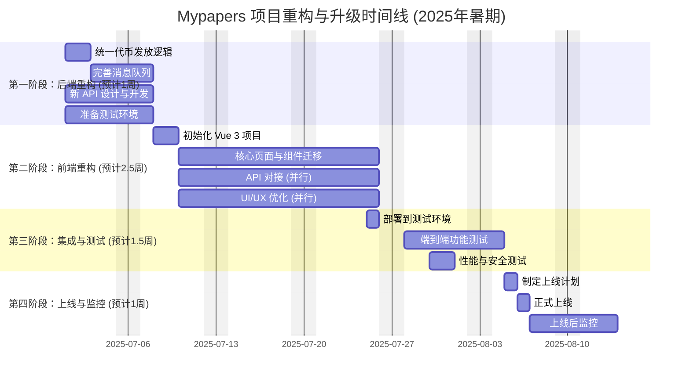

> [!quote]
> 我们面临的不仅仅是一个简单的安全漏洞修复，而是一次对项目架构进行纠偏、对技术栈进行现代化的机会。mypapers 的技术债已经比较严重，利用这个机会好好重新设计，把它打造成一个现代化的稳健产品，这是不可多得的机会。  
> 
> 下面这份计划，我经过一系列分析指明了清晰、渐进的开发方向。请大家仔细阅读，并准备在项目启动会上讨论任何疑问。我相信通过我们团队的共同努力，不仅能解决眼下的问题，更能让我们的产品在技术和架构上都迈上一个新的台阶。  

---

## **Mypapers 项目：代币发放逻辑重构与前端现代化计划**

**文档版本:** 1.0  
**日期:** 2025-06-30  
**负责人:** 叶文博  

### **1. 背景与目标**

我们在之前的安全审查中发现，项目的注册奖励发放逻辑完全由前端控制，这带来了严重的安全风险。虽然经过 振超 和 君晟 的努力，合约层已进行初步修复（增加了 `onlyOwner` 限制），但整体架构问题依然存在，主要体现在以下几个方面：

1.    **架构混乱:**   
    前后端职责不清，前端代码与智能合约深度耦合，执行了大量本应由后端处理的敏感操作。     
    
2.   **安全隐患:**   
    除了注册漏洞外，前端多处直接调用合约的 `mint`, `transfer` 等函数，绕过了后端的所有安全校验和业务逻辑，项目的安全性更改并未产生实质性效果。  
  
3.   **双重发放逻辑:**   
    当前后端存在`区块链注册`和`消息队列`两种代币发放逻辑，这会导致逻辑混乱和潜在的重复发放问题。  
      
4.   **技术债务:**   
    前端框架基于 Vue 2，部分代码风格不一，可以借此重构机会进行技术升级，提升开发效率和项目可维护性。  
    

**本次计划的核心目标：**

1.  **彻底修复安全问题:** 将所有与合约的写操作（`mint`, `transfer`, `storeHash` 等）迁移至后端，前端只负责调用后端 API。  
2.  **清晰化架构:** 明确前后端职责，实现前后端分离和业务逻辑的统一。  
3.  **技术栈升级:** 将前端从 Vue 2 升级到 Vue 3，引入 Composition API、Pinia 等现代化工具链，为未来功能迭代铺平道路。  
4.  **提升系统健壮性:** 完善后端事务管理和消息队列的错误处理机制。  

### **2. 项目团队与分工**

> [!note] 关于计划人数
> 要做成项目，最少需要 2 名前端开发者，2 名后端开发者（**其中一名需要懂链端开发**），1 名 DevOps （能参与部分开发的运维人员）

*   **前端开发者 叶文博 & 林振超:** 负责整个前端应用的重构和 Vue 3 升级。
*   **后端开发者 A & B:** 负责后端 API 的开发、智能合约的审阅与调整、以及数据库和消息队列的逻辑重构。
*   **运维工程师:** 负责部署新架构、管理环境变量、维护测试环境与生产环境的稳定性。

### **3. 开发计划与任务分解**

我将项目分为四个主要阶段，每个阶段都有明确的任务和负责人。  

> [!tip]
> - 下面预计的开发周期，要求参与人员每周至少在项目上花 7 小时 （约等于全职开发者的 1天）的投入  
> - 部分任务可以并行展开，比如第一阶段和第二阶段。参与的开发者应该“自己对照任务表找任务做”，避免在联调测试的时候出现互相等的情况。  

---

#### **第一阶段：后端重构与 API 定义 (预计 1 周)**

**目标:** 搭建稳固的后端基础，为前端重构提供所有必要的 API 接口。  

> 由于本人不是专业开发者，这部分内容希望有能力的后端组长能主动调整。  

| 任务 | 描述 | 负责人 | 产出物 |
| :--- | :--- | :--- | :--- |
| **1.1: 统一代币发放逻辑** | - 审查 `server/api/user.go` 中的注册逻辑。 - 移除向 RabbitMQ 发送“注册赠送”消息的代码，因为 `registerUser` 合约函数已包含代币发放。 - 确保后端只通过调用 `registerUser` 合约函数来完成注册和奖励发放。 | **后端开发者 A** | - 修正后的 `server/api/user.go` 代码 - 内部逻辑评审通过 |
| **1.2: 设计并开发新的后端 API** | - **核心任务:** 梳理前端所有 `contractInstance.methods` 调用，为每一个调用创建一个对应的后端 API。 - **API 列表 (部分):**    - `POST /api/v1/paper/store-hash` (替代 `storeHash`)    - `POST /api/v1/review/submit` (替代 `storeReview`)    - `POST /api/v1/nft/transfer` (替代 `safeTransferFrom`)    - `GET /api/v1/contract/balance/:address` (替代 `balanceOf`)   - ... 等所有其他合约调用。 | **后端开发者 B** | - 一份完整的 API 设计文档 (如 Swagger/OpenAPI) - 所有新 API 的代码实现 |
| **1.3: 完善消息队列消费者** | - 审查 `server/task/mpsTxTask.go` 中的消费者逻辑。 - 明确该消费者**只处理**充值成功、活动奖励等**非注册场景**的代币发放。 - 增加更详细的日志和错误处理（例如，交易失败后发送通知或记录到死信队列）。 - 将 `ConsumeSimple` 中的 `auto-ack` 改为 `false`，在处理成功后再手动 `msg.Ack(false)`，处理失败则 `msg.Nack(false, true)` 重新入队或 `msg.Nack(false, false)` 进入死信队列，防止消息丢失。 | **后端开发者 A** | - 优化后的 `mpsTxTask.go` 和 `rabbitmq.go` - 健壮的错误处理和消息确认机制 |
| **1.4: 智能合约审阅** | - 再次确认 `MPS.sol` 合约的 `mint` 和 `registerUser` 函数符合 `onlyOwner` 权限。 - 估算并确保合约在部署时有足够的初始代币用于未来的注册奖励。 | **后端开发者 A & B** | - 合约审阅确认文档 |
| **1.5: 准备测试环境** | - 搭建一个独立的 Staging 环境。 - 部署当前的后端代码和数据库。 - 配置好所有环境变量，特别是新的合约地址和管理员私钥。 | **运维工程师** | - 可用的 Staging 环境 URL 和数据库访问凭证 |

---

#### **第二阶段：前端重构与 Vue 3 升级 (预计 2.5 周)**

**目标:** 完成前端应用的彻底重构，切换到 Vue 3，并使用新的后端 API 替换所有合约调用。  

> [!quote] 为什么选择整体重构？真的要必要花时间重写到 vue3 吗？  
> 本文末尾给出了详细的说明，请见 [[#备注： 为什么要费心思重写前端？就用 vue2 不行吗？]]

| 任务                    | 描述                                                                                                                                                                                                                                                                              | 负责人                 | 产出物                                         |
| :-------------------- | :------------------------------------------------------------------------------------------------------------------------------------------------------------------------------------------------------------------------------------------------------------------------------ | :------------------ | :------------------------------------------ |
| **2.1: 初始化 Vue 3 项目** | - 使用 Vite 创建一个新的 Vue 3 项目。 - 配置 TypeScript, Pinia (替代 Vuex), Vue Router, 和 Element Plus/Ant Design Vue。 - 建立新的项目结构和代码规范。                                                                                                                                                  | **前端开发者 叶文博**       | - 一个可运行的、配置完整的 Vue 3 项目骨架                   |
| **2.2: 核心页面与组件迁移**    | - **任务并行:**    - **开发者 A:** 负责迁移用户中心 (`/center`) 相关的页面，如 `MyNFTs`, `Recharge`, `Mint` 等。   - **开发者 B:** 负责迁移主站 (`/home`) 相关的页面，如 `Register`, `Home`, `DetailPaper` 等。 - **重构要求:**    - 使用 Composition API (`<script setup>`) 风格重写逻辑。   - 将状态管理逻辑迁移到 Pinia store。 | **前端开发者 叶文博 & 林振超** | - 所有页面和组件的 Vue 3 版本代码                       |
| **2.3: API 对接**       | - **核心任务:** 移除所有 `web3.js` 和 `contractInstance` 的直接调用。 - 将所有与后端交互的逻辑封装到 `src/api` 目录下的模块中。 - 使用 `axios` 或 `fetch` 调用在**阶段一**中由后端开发的新 API。                                                                                                                                 | **前端开发者 叶文博 & 林振超** | - 一套完整的 API 服务模块 - 所有组件都通过调用 API 来完成业务逻辑 |
| **2.4: 移除前端依赖**       | - 从 `package.json` 中移除 `web3` 等与合约交互相关的依赖。                                                                                                                                                                                                                                      | **前端开发者 叶文博**       | - 清理后的 `package.json` 文件                    |
| **2.5: UI/UX 优化**     | - 在重构过程中，对现有页面的布局、交互和视觉效果进行适度优化。                                                                                                                                                                                                                                                | **前端开发者 叶文博 & 林振超** | - 体验更佳的用户界面                                 |

---

#### **第三阶段：集成、测试与部署 (预计 1 周)**

**目标:** 将重构后的前后端部署到测试环境，进行完整的功能和回归测试，确保系统稳定。  

> 这部分需要大量的测试、纠错，需要大家都积极的参与讨论和测试。在这一周，希望大家保持至少 2 天一次的远程会议。  

| 任务 | 描述 | 负责人 | 产出物 |
| :--- | :--- | :--- | :--- |
| **3.1: 部署到测试环境** | - 部署后端新代码到 Staging 环境。 - 部署前端新代码到 Staging 环境，并配置好 Nginx 代理。 | **运维工程师** | - 运行着新版应用的 Staging 环境 |
| **3.2: 端到端功能测试** | - **全员参与，编写测试用例。** - **测试场景:**    - **注册流程:** 新用户注册 -> 检查数据库 -> 检查区块链浏览器，确认用户收到代币。   - **充值流程:** 创建订单 -> 模拟支付回调 -> 检查消息队列 -> 确认用户收到代币。   - **论文/NFT 操作:** 上传论文、铸造 NFT 等操作，确认功能正常。   - **权限测试:** 尝试使用普通用户身份调用管理员 API，确认被拒绝。 | **全体团队** | - 测试用例报告 - Bug 修复列表 |
| **3.3: 性能与安全测试** | - 简单压力测试，检查新 API 的性能。 - 再次确认前端没有任何敏感信息（如私钥）泄露。 | **后端开发者 A & 运维工程师** | - 性能和安全测试报告 |

---

#### **第四阶段：上线与监控 (预计 0.5 周)**

**目标:** 平稳地将新系统上线，并进行持续监控。

| 任务              | 描述                                                    | 负责人               | 产出物                        |
| :-------------- | :---------------------------------------------------- | :---------------- | :------------------------- |
| **4.1: 制定上线计划** | - 确定上线时间窗口（建议在业务低峰期）。 - 准备数据库备份和回滚方案。              | **运维工程师 & 团队负责人** | - 详细的上线流程文档 (Go-Live Plan) |
| **4.2: 正式上线**   | - 执行上线计划，部署新版前后端应用到生产环境。                              | **运维工程师**         | - 新版应用在生产环境成功上线            |
| **4.3: 上线后监控**  | - 密切关注生产环境的日志（特别是错误日志）和系统性能指标。 - 快速响应并修复可能出现的紧急问题。 | **全体团队**          | - 稳定的生产系统                  |

### **4. 时间线概览**

### **5. 风险与应对策略**

> [!note] 
> 鉴于老师着急在假期进行项目 demo ，核心业务的尽快上线变得尤为重要

1.  **风险:** 前端重构工作量超出预期。
    *   **应对:** 优先迁移核心业务流程页面，对于非核心页面可分批次进行；两名前端开发者保持高度沟通，共享可复用组件。
2.  **风险:** 后端定义的 API 无法完全满足前端需求。  
    *   **应对:** 前后端每日站会保持沟通，API 文档先行，前端尽早介入评审。使用 Mock API 工具让前端提前开工。
3.  **风险:** 测试阶段发现未知的基础架构问题。  
    *   **应对:** 在阶段一就让运维提前介入，尽早暴露环境问题。预留充足的测试和 Bug 修复时间。

---

## 备注： 为什么要费心思重写前端？就用 vue2 不行吗？  

如果真想让项目长久运营下去而不是得过且过，重构到 vue3 是**必须的事情**，大家都不应该抱着侥幸心理，这是不负责任的。  

当前项目的核心问题是：**前端必须进行一次大规模的重构，以剥离所有不安全的、直接与合约交互的逻辑。** 这项工作是无法避免的，无论我们使用 Vue 2 还是 Vue 3。

这意味着，我们的前端开发者无论如何都将：
1.  **触及大部分组件和视图**：从 `Register.vue` 到 `Recharge.vue`，再到所有涉及 `contractInstance` 调用的地方。
2.  **重写数据流和状态管理**：因为之前的数据获取和状态变更很多是直接通过 `web3.js` 完成的。
3.  **重新封装 API 请求**：将所有操作都改为调用后端 API。

既然“重构”这个成本是固定的、必须付出的，那么问题就变成了：**我们是在一个即将过时的技术栈（Vue 2）上进行大规模重构，还是在一个代表未来的技术栈（Vue 3）上进行？**

答案显而易见。在旧路上打补丁，不如直接铺设一条新的高速公路。**我们绝不能浪费这个绝佳的机会。**

---

### **升级到 Vue 3 的具体收益分析**

> [!quote]  
> 下面的每一条分析，都是咱们项目前端目前的痛点，这些严重阻碍了项目未来的发展。要想让 mypapers 变成真的现代化的、稳健的、面向未来的项目，重构到 vue3 能完美解决这些问题。  

| 收益点                      | 对我们项目的具体好处                                                                                                                                                                                                                                                                         |
| :----------------------- | :--------------------------------------------------------------------------------------------------------------------------------------------------------------------------------------------------------------------------------------------------------------------------------- |
| **1. Composition API**   | 这是最有说服力的一点。Vue 2 的 Options API 会导致相关逻辑分散在 `data`, `methods`, `computed`, `watch` 中，难以维护。**Composition API 允许我们按功能组织代码**。例如，所有与“获取用户NFT列表”相关的逻辑（状态、方法、计算属性）都可以封装在一个 `useUserNFTs.js` 文件中，然后在多个组件中复用。这对于我们这种有大量独立业务模块（用户中心、论文提交、市场）的应用来说，可以极大地提升代码的可读性、可维护性和复用性，**显著降低未来增加新功能的复杂度**。 |
| **2. 性能提升**              | Vue 3 在虚拟 DOM、编译时优化等方面有显著的性能提升。页面之间跳转的性能优化可以带来肉眼能感知的提升。                                                                                                                                                                                                                            |
| **3. 更好的 TypeScript 支持** | 🌟这个是项目最大的收益！   在这次大规模重构中，**强制使用 TypeScript 可以大大减少低级错误**，以后即便咱们毕业了，mypapers 交给学弟以后，TS  带来的收益也可以让学弟学妹们省很多事。它确保 API 接口调用以及各种类型推断的正确性，让接手的学弟学妹们会更加容易理解这个项目。                                                                                                                        |
| **4. 现代化的工具链 (Vite)**    | 相比于 vue2 的 Webpack 的 Vue CLI，转向使用 **近乎秒级的项目启动和热更新速度** 的 Vite。对于前端开发者来说，这意味着。在一个为期数周的重构项目中，每天节省下来的编译和等待时间累积起来是非常可观的，这直接关系到开发效率。                                                                                                                                                     |
| **5. 生态系统和长期支持 (LTS)**   | Vue 2 已于 2023 年底停止积极维护，社区的焦点都将围绕 Vue 3 构建。**继续使用 Vue 2 是在主动地积累技术债务**，未来招聘新人、引入新库的成本都会越来越高。                                                                                                                                                                                         |

---

### **不升级的危害（继续使用 Vue 2）**

1.  **浪费重构机会**：我们花费了大量精力在 Vue 2 上重构，但最终得到的仍然是一个基于过时技术栈、难以维护的应用。一两年后，当性能或功能瓶颈出现时，我们可能需要进行第二次重构，这是巨大的资源浪费。
2.  **降低团队士气**：vue2 已经没人愿意学了，你让接手的学弟去学 vue2 ，会影响他们的成长感和积极性。拥抱新技术能让团队保持活力。

### **对升级成本的评估**

由于我们本来就要重写大部分逻辑，所以“迁移”成本已经和“重构”成本高度重叠了。  
我们不是在做一个平滑的、组件对组件的迁移，而是在用新的思想构建新的代码，这反而比试图在旧代码上修修补补要更清晰、更简单。  

而且，最耗时间的 UI 部分完全可以沿用之前的 CSS，逻辑的重构是不花时间的（如果你对 vue3 熟悉的话）

### **结论**

**必须升级，因为利远大于弊。**

我们正站在一个“推倒重建”的十字路口。继续沿用 Vue 2，就像是给一栋地基有问题的旧房子做精装修，表面光鲜，但隐患仍在。而选择升级到 Vue 3，则是在为我们的项目构建一个坚固、现代、可扩展的新地基。

作为组长，我强烈建议抓住这次宝贵的机会，**将 Vue 3 升级作为本次重构的核心目标之一**。这不仅是为了修复眼前的安全漏洞，更是对项目未来几年的技术健康度和团队开发效率的一项战略性投资。  